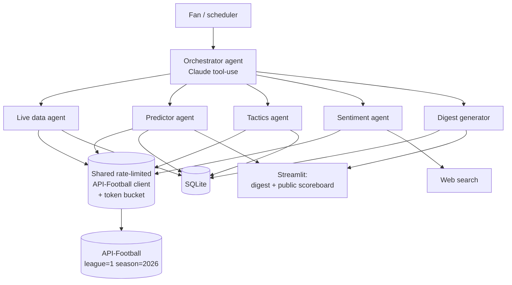

# Architecture

## Overview

A single **orchestrator** agent (Claude, tool use) routes work to four **specialist** agents.
Every specialist talks to API-Football through **one shared rate-limited client** — never
directly — so the 10 req/min free-tier budget is enforced in one place
(see [api-football.md](api-football.md)).

## Agents (summary — full contracts in [agents.md](agents.md))

| Agent | Responsibility | Primary endpoints |
|---|---|---|
| Orchestrator | Routes a digest/predict/analyze request to specialists, assembles output | — (Claude tool-use) |
| Live data | Scores, fixtures, standings, rounds | `/fixtures?live=all`, `/fixtures?ids=…`, `/standings`, `/fixtures/rounds` |
| Predictor | Baseline prediction + reasoning layer; writes eval rows | `/predictions?fixture=ID` |
| Tactics | Stat-grounded match narrative + player-of-match | `/fixtures?id=ID`, `/fixtures/players`, `/coachs`, `/fixtures/headtohead` |
| Sentiment | Injuries + news context for the predictor | `/injuries`, web search |

## Request flow — a morning digest run

1. Scheduler (or user) triggers the orchestrator with a set of **followed teams**.
2. Orchestrator asks the **live data agent** for last night's finished fixtures involving those teams
   (one batched `/fixtures?ids=…` call) and current `/standings`.
3. For each relevant fixture: **tactics agent** pulls embedded events/lineups/stats and player ratings;
   **predictor agent** reconciles its pre-match prediction against the actual result and writes the eval row.
4. **Advancement calculator** derives scenarios from the `/standings` snapshot (no extra API call).
5. **Digest generator** assembles the fan-facing summary from DB rows (no fresh API calls) and renders
   it (and, if enabled, the multilingual variant) into the Streamlit UI.

## Deploy model — and why not serverless

- Run as a **persistent web service** (Fly.io / Render) so the egress IP is stable.
- **Avoid** edge/serverless (Lambda, Cloudflare Workers, Vercel/Netlify Functions) for the
  API-calling backend: API-Football rate-limits **per IP** as well as per key, so a shared egress
  IP can get you throttled by another tenant's traffic, and a cold-start function can't hold the
  shared token bucket in memory across invocations.
- A single long-lived process also lets the shared rate limiter and non-live caches actually persist.
